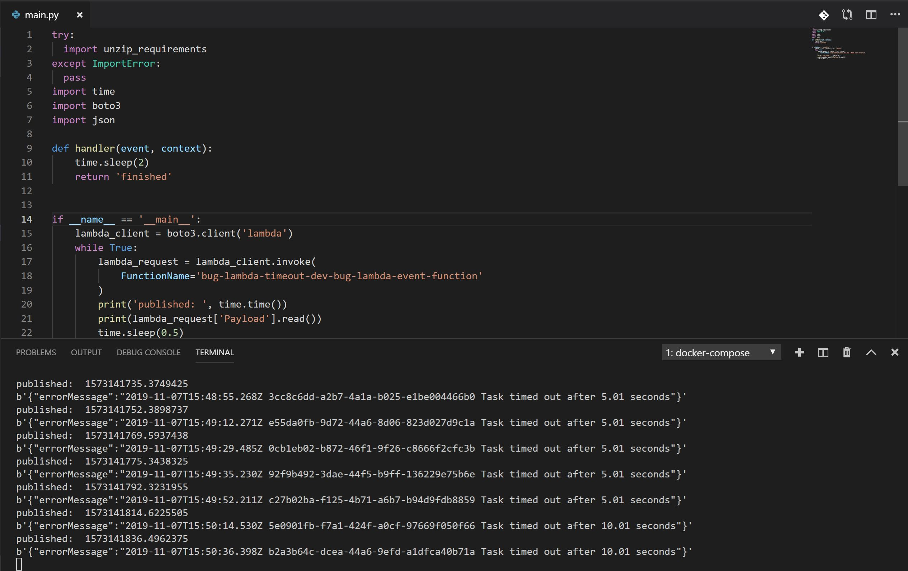

# bug-aws-lambda-infinite-timeout
Repository to reproduce the aws lambda bug of non-stop timeout after a first timeout

# Bug Trigger

When the lambda package is too large, after the lambda times out once, it times out forever. It does not matter if you increase the timeout or memory in AWS.

In this repo, the dependencies are large when zipped to upload to AWS in order to reproduce the bug.

# How to run it

copy the aws credentials file like below

``` bash
cp aws_env.env.rename aws_env.env 
```

fill the credentials file that will be used inside your container

Starting the container

``` bash
docker-compose run --rm bug-lambda-service bash
```

Deploying the application

``` bash
serverless deploy
```

Run the script to continuously invoke the lambda function

``` bash
python main.py
```


Then go to AWS console and reduce the timeout to **1 seconds**. The function will start to timeout.
After it starts to timeout, increate the timeout in AWS' console to something greater than 3 seconds. Even putting it to 30 seconds. It will continue to timeout.

The image below shows the execution of the lamda.
Even though it is only a sleep of **2 seconds**, after it starts timing out, it never recovers. Even after **10 seconds** of waiting time.



